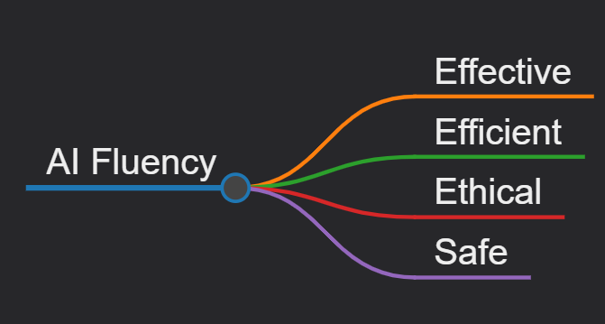
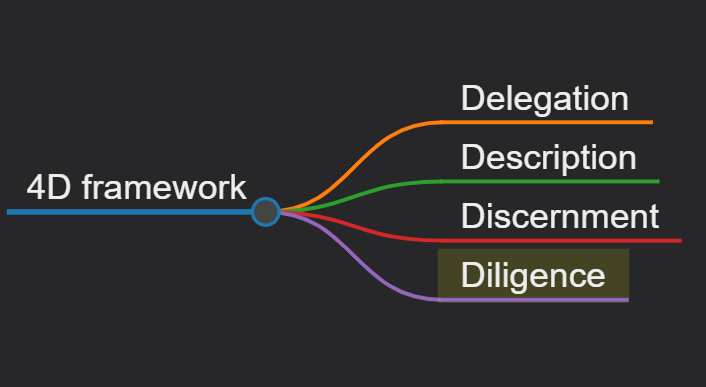

**What is AI Fluency?**
AI Fluency involves developing practical skills, knowledge, insights, and values that help you interact with AI systems in ways that are effective, efficient, ethical, and safe.

**Automation**: The AI completes specific tasks based on your instructions.

**Augmentation**: You and AI collaborate as creative thinking and task execution partners.

**Agency**: You configure AI to work independently on your behalf, establishing its knowledge and behavior patterns rather than just giving it specific tasks.

**The 4D framework**

**Delegation**: Thoughtfully deciding what work to do with AI vs. doing yourself

**Description**: Communicating clearly with AI systems

**Discernment**: Evaluating AI outputs and behavior with a critical eye

**Diligence**: Ensuring you interact with AI responsibly

# Delegation

**Problem Awareness**: Understanding your goals and the work involved to achieve it

**Platform Awareness**: Knowing what different AI systems can do

**Task Delegation**: Strategically dividing work between you and AI

# Description

**Product Description**: Clearly defining what you want the AI to create

**Process Description**: Guiding how the AI approaches your request

**Performance Description**: Defining how you want the AI to behave during your collaboration

# Discernment

**Product Discernment**: Evaluating the quality of AI outputs

**Process Discernment**: Assessing how the AI approached the task

**Performance Discernment**: Evaluating how the AI behaved during the interaction itself

# Diligence

**Creation Diligence**: Being thoughtful about which AI systems you choose and how you work with them

**Transparency Diligence**: Being open about AI's role in your work

**Deployment Diligence**: Taking ownership for AI-assisted outputs you share with others

# CLAUDE.md Files

* Guides Claude through your codebase, pointing out important commands, architecture, and coding style
* Allows you to give Claude specific or custom directions

3 Types of calude.md files
* CLAUDE.md - Generated with /init, committed to source control, shared with other engineers
* CLAUDE.local.md - Not shared with other engineers, contains personal instructions and customizations for Claude
* ~/.claude/CLAUDE.md - Used with all projects on your machine, contains instructions that you want Claude to follow on all projects
