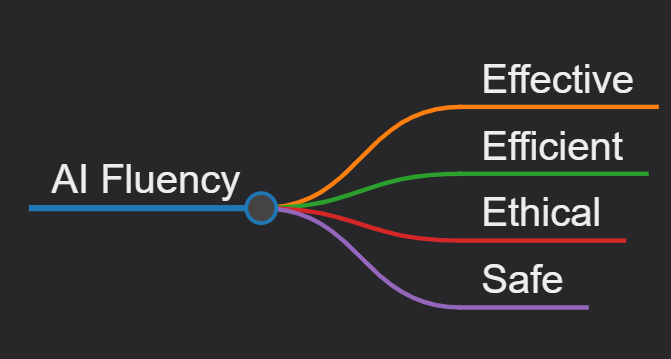
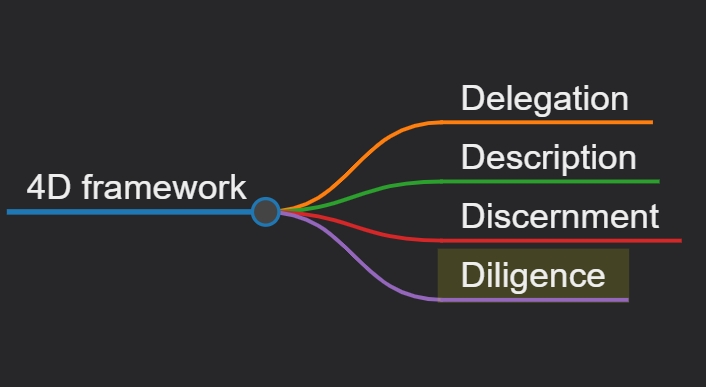

**What is AI Fluency?**
AI Fluency involves developing practical skills, knowledge, insights, and values that help you interact with AI systems in ways that are effective, efficient, ethical, and safe.

**Automation**: The AI completes specific tasks based on your instructions.

**Augmentation**: You and AI collaborate as creative thinking and task execution partners.

**Agency**: You configure AI to work independently on your behalf, establishing its knowledge and behavior patterns rather than just giving it specific tasks.

**The 4D framework**

**Delegation**: Thoughtfully deciding what work to do with AI vs. doing yourself

**Description**: Communicating clearly with AI systems

**Discernment**: Evaluating AI outputs and behavior with a critical eye

**Diligence**: Ensuring you interact with AI responsibly

# Delegation

**Problem Awareness**: Understanding your goals and the work involved to achieve it

**Platform Awareness**: Knowing what different AI systems can do

**Task Delegation**: Strategically dividing work between you and AI

# Description

**Product Description**: Clearly defining what you want the AI to create

**Process Description**: Guiding how the AI approaches your request

**Performance Description**: Defining how you want the AI to behave during your collaboration

# Discernment

**Product Discernment**: Evaluating the quality of AI outputs

**Process Discernment**: Assessing how the AI approached the task

**Performance Discernment**: Evaluating how the AI behaved during the interaction itself

# Diligence

**Creation Diligence**: Being thoughtful about which AI systems you choose and how you work with them

**Transparency Diligence**: Being open about AI's role in your work

**Deployment Diligence**: Taking ownership for AI-assisted outputs you share with others

# CLAUDE.md Files

* Guides Claude through your codebase, pointing out important commands, architecture, and coding style
* Allows you to give Claude specific or custom directions

3 Types of calude.md files
* CLAUDE.md - Generated with /init, committed to source control, shared with other engineers
* CLAUDE.local.md - Not shared with other engineers, contains personal instructions and customizations for Claude
* ~/.claude/CLAUDE.md - Used with all projects on your machine, contains instructions that you want Claude to follow on all projects

# Shorts for Claude communication 

* Planning Mode -complex tasks that require extensive research across your codebase, you can enable Planning Mode 

   /plan or Shift +Tab(if Planning Mode not enabled already)

* Effort Level - Claude to think on hard 

   /effort 

## Planning vs. Effort Comparison

| Planning | Effort Level |
| :--- | :--- |
| <ul><li>Tasks requiring broad understanding of your codebase</li><li>Multi-step implementations</li><li>Changes that affect multiple files or components</li></ul> | <ul><li>Complex logic problems</li><li>Debugging difficult issues</li><li>Algorithmic challenges</li></ul> |

## Skills vs. other Claude Code features

| Feature | What it does | When it runs | Simple way to remember it |
|---|---|---|---|
| **CLAUDE.md** | Tells Claude the basic rules of your project | Every single session, automatically | The rulebook Claude always reads |
| **Skills** | Gives Claude know-how for a specific task | Only when the task needs it | A manual Claude picks up when useful |
| **Hooks** | Forces something to happen every time | Triggered by events (before/after actions) | A robot rule — no thinking, just does it |
| **Subagents** | Sends work to a separate helper session | When Claude wants to delegate a task | A helper working in their own room |
| **Slash commands** | Quick shortcut for a saved prompt | When you type `/something` | Your saved shortcut key |
| **MCP servers** | Connects Claude to outside tools (GitHub, databases, etc.) | When Claude needs outside data or action | A bridge to other apps |
| **Plugins** | Packages several of the above together to share with a team | Installed once, used by everyone | A toolbox you hand to your team |

## One-line summary

- **CLAUDE.md** = always-on rules
- **Skills** = on-demand know-how
- **Hooks** = automatic enforcement
- **Subagents** = separate helpers
- **Slash commands** = shortcuts
- **MCP** = outside connections
- **Plugins** = shared toolbox
